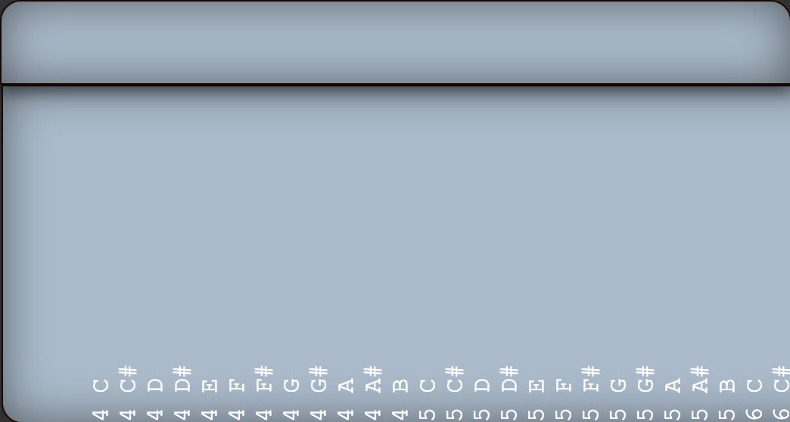
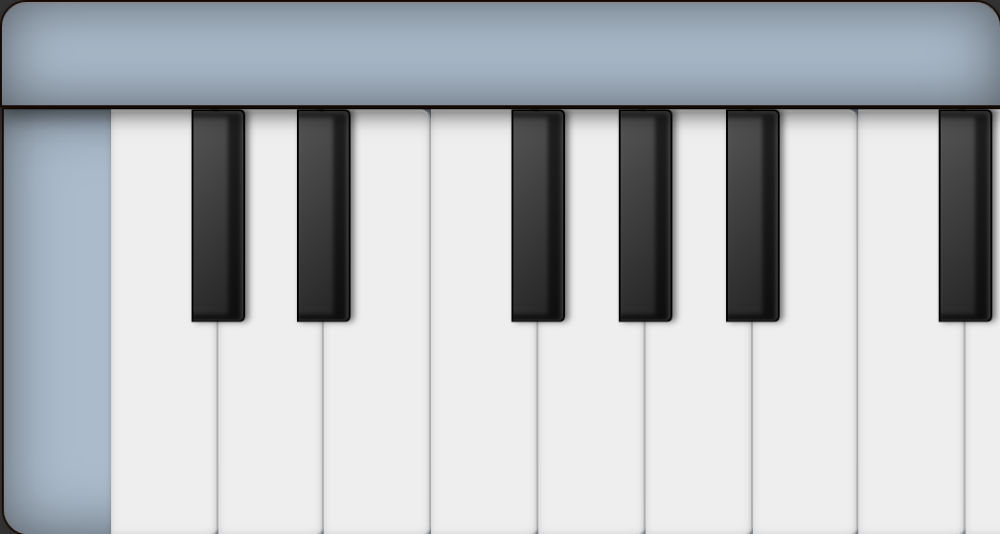
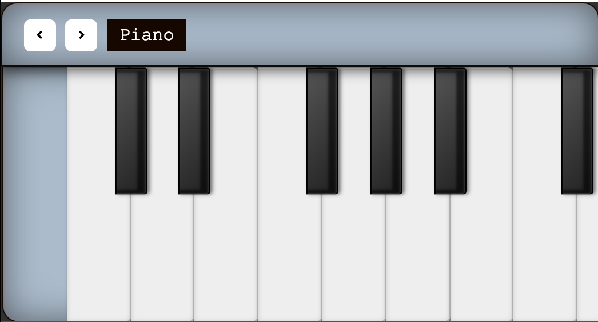

# PianoJS Tutorial

This tutorial was created for a Workshop at the event
TECH(K)NOW 2018. Start the tutorial in Step 0.

## Step 0: Initial point

### Online IDE

https://codesandbox.io/s/yq77xr7nwv

### Local IDE

Copy the folder `src-step-0` to `src`, open your favourite text
editor and run `npm start` (After running `npm i`, of course).

The folder includes:

-   `utils` folder: Includes what you don't know where to put. In
    this case a map of notes to frequencies and a piano sprite.
-   `index.js`: starting point
-   `styles.css`: Includes all the styles you will need to
    allow you to focus in the React part.

## Step 1: Create Keyboard component

## Step 2: Create Key component

## Step 3: Adding WebAudio synth

## Step 4: Adding Controls component

## Step 5: Adding real piano samples

# Contributing

Feel free to contribute! It is very much appreciated!

# License

MIT
